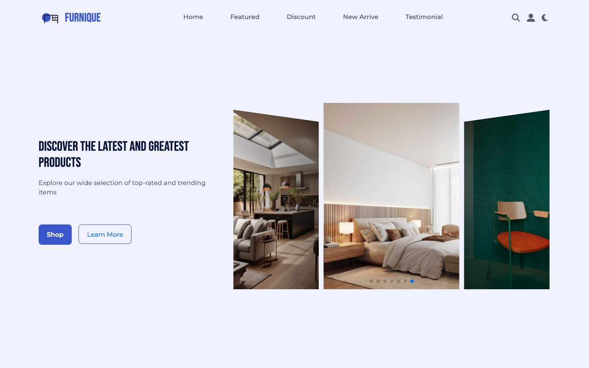

# Furnique E-commercial Webpage

 

Furnique is an elegantly designed e-commerce platform offering a curated selection of furniture to transform any space into a stylish, comfortable haven.

## Technologies Used
- **Html**
- **Css**
- **Javascript**
- **jQuery**
- **JS Library: Lightbox, Scrollreveal, Leaflet, Swiper**

## Color Reference 
| Color           | Hex      |
| --------------- | -------- |
| Deep Blue       |  #4960d4  |
| Light Blue      | #0c1645  |
| Purple          | #606785  |
| Grey            | #d9ddf2  |
| Gradient color  |  #f0f2ff |

Feel free to explore and contribute to this project. If you have any suggestions or find issues, please create a GitHub issue.

